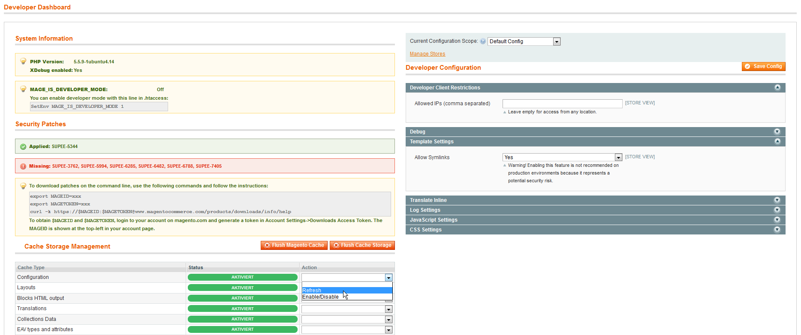

IntegerNet DevDashboard
=====================
Magento 1 extension: Provides an alternative admin dashboard for developers

Facts
-----
- version: 0.1.0
- composer key: integer-net/dev-dashboard
- [extension on GitHub](https://github.com/integer-net/DevDashboard)
- [direct download link](https://github.com/integer-net/DevDashboard/archive/master.zip)

Description
-----------
The extension adds a developer dashboard that you can choose as your start page for the admin panel. It contains the following widgets:

- Cache control: View cache status, flush cache
- Developer settings: View and set current developer settings
- System information: Display PHP version and other system information
- Patch information: Display applied and missing security patches (daily updated via http://tools.hypernode.com/)

Requirements
------------
- PHP >= 5.5 (might work on PHP 5.4 but as unsupported PHP version this is not tested. See: http://php.net/supported-versions.php)

Compatibility
-------------
- Magento CE 1.7.0.2 - Magento CE 1.9.2.4

Installation Instructions
-------------------------
1.    Add all files in to the Magento root or use modman to link them
2.    Clear the cache
3.    Log out admin user and log in again (if you don't have [SSE AclReload](https://github.com/schmengler/AclReload) installed)

Uninstallation
--------------
1. Remove all extension files from your Magento installation

Test
----
To run the integration test suite, set up [EcomDev PHPUnit](https://github.com/EcomDev/EcomDev_PHPUnit) and run from the Magento root:

    phpunit --group IntegerNet_DevDashboard

Support
-------
If you have any issues with this extension, open an issue on [GitHub](https://github.com/integer-net/DevDashboard/issues).

Contribution
------------
Any contribution is highly appreciated. The best way to contribute code is to open a [pull request on GitHub](https://help.github.com/articles/using-pull-requests).

Developer
---------
Fabian Schmengler, integer\_net GmbH ([@fschmengler](https://twitter.com/fschmengler))

License
-------
[OSL - Open Software Licence 3.0](http://opensource.org/licenses/osl-3.0.php)

Copyright
---------
Copyright (c) 2016 integer\_net GmbH
[http://www.integer-net.com](http://www.integer-net.com) ([@integer_net](https://twitter.com/integer_net))

---

Used code to check for applied patches from [Philwinkle_AppliedPatches](https://github.com/philwinkle/Philwinkle_AppliedPatches/)

Copyright (c) 2015 Philwinkle LLC / Phillip Jackson ([see source](app/code/community/IntegerNet/DevDashboard/Model/AppliedPatches.php))